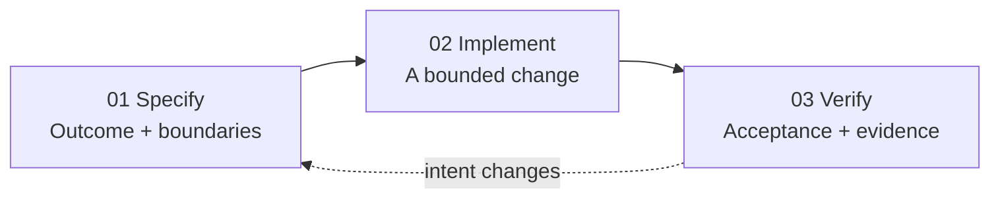
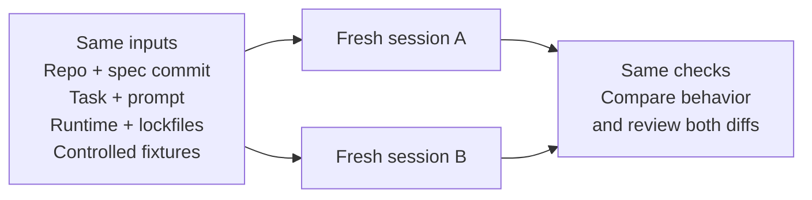

# Spec-Driven Development (SDD)

**A practical workflow for AI-assisted development.**

> Define intent. Build with constraints. Verify the result.

This repository holds a 12-slide presentation from **Convocare Engineering** on Spec-Driven Development. SDD means you write down what you intend before any code exists. Reviewed plans and bounded tasks then limit what gets built, and the result is accepted only against explicit evidence.

| File | Description |
| --- | --- |
| [`sdd.pptx`](sdd.pptx) | Presentation (English) |
| [`sdd-ro.pptx`](sdd-ro.pptx) | Presentation (Romanian) |

> [!NOTE]
> The goal is **repeatable behavior and a repeatable process**. SDD does not promise identical regenerated source code or automatic productivity gains.

---

## Contents

1. [Why it helps](#1-why-it-helps)
2. [What SDD means](#2-what-sdd-means)
3. [The workflow](#3-the-workflow)
4. [Organizing the Markdown](#4-organizing-the-markdown)
5. [Writing the specification](#5-writing-the-specification)
6. [Clarifying the requirements](#6-clarifying-the-requirements)
7. [Reusing a proven foundation](#7-reusing-a-proven-foundation)
8. [SDD vs. vibe coding](#8-sdd-vs-vibe-coding)
9. [How SDD avoids vibe coding](#9-how-sdd-avoids-vibe-coding)
10. [Reproducibility](#10-reproducibility)
11. [Adopting the workflow](#11-adopting-the-workflow)
12. [Further reading](#further-reading)

---

## 1. Why it helps

**Loose prompts leave important decisions open.**

| # | Problem | Effect |
| --- | --- | --- |
| 01 | **Ambiguity** | Unwritten rules become guesses. |
| 02 | **Context loss** | Decisions disappear between sessions. |
| 03 | **Weak validation** | Output lacks clear acceptance evidence. |

*Record consequential decisions once. Reuse them in every session.*

Exploratory prompting works well for discovery. Accepting an implementation, though, needs criteria everyone agreed on. When you judge whether the workflow saves effort, include the time spent drafting and reviewing.

## 2. What SDD means

**The spec defines what "done" means.**



- Review the spec **before** code. Accept the code **against** the spec.
- When intent changes, update the affected spec, plan, tasks and checks together.
- Markdown cannot enforce requirements by itself. Tests and review are what confirm the result matches the criteria.

## 3. The workflow

**Resolve intent before generating code.**

| Lane | Phases | Output |
| --- | --- | --- |
| **Frame** | 01 Guardrails → 02 Specify | Shared rules + outcome |
| **Resolve** | 03 Clarify → 04 Plan | Decisions + approach |
| **Deliver** | 05 Tasks → 06 Build + verify | Bounded work + evidence |

*Review each artifact before using it as the next input.* Scale the process to how much the change matters.

## 4. Organizing the Markdown

**Give each file one job.**

| File | Purpose | Contents |
| --- | --- | --- |
| `constitution.md` | Shared guardrails | Stack, conventions, required checks |
| `specification.md` | What + why | Behavior, scope, non-goals, acceptance |
| `plan.md` | How | Architecture, contracts, data, dependencies, risks |
| `tasks.md` | What to do next | Order, dependencies, proof |
| `ui.md` *(optional)* | Interaction | States, transitions, layout, responsiveness, accessibility |

> [!TIP]
> For small features, these can be sections of a single `specs.md`. Existing repository instructions can also supply the guardrails. Filenames vary from tool to tool.

## 5. Writing the specification

**Write observable behavior.** Acceptance criteria follow a Given / When / Then structure:

```gherkin
GIVEN  preconditions and relevant state
WHEN   the action or event that triggers behavior
THEN   the observable result and measurable checks
```

- Include **scope**, **non-goals** and **measurable acceptance criteria**.
- A quantitative target needs a number, a workload and a way to measure it.
- Keep intended behavior separate from technical planning.

## 6. Clarifying the requirements

**Resolve ambiguity before implementation.**

| Area | Focus |
| --- | --- |
| **Scope** (boundaries) | Define included and excluded behavior. |
| **Rules** (decisions) | Record permissions, limits and constraints. |
| **Failures** (error handling) | Define invalid states and recovery behavior. |

*Clarify consequential unknowns. Make assumptions visible.* An agent may point out gaps, but it should not quietly make up product policy.

## 7. Reusing a proven foundation

**Reuse a verified foundation.**

| Step | What | Benefit |
| --- | --- | --- |
| 01 Reuse | Proven template: reviewed architecture and tested components | Less reinvention |
| 02 Reproduce | AI repeats patterns: reuse structure and conventions | More consistent code |
| 03 Verify | Repeatable checks: reuse build, tests and review standards | Trust backed by evidence |

Pin the template revision, dependency versions and setup/check commands. Reproducing patterns helps keep code consistent, but it does not make every new change correct.

## 8. SDD vs. vibe coding

|  | Vibe coding | SDD |
| --- | --- | --- |
| **Intent** | Prompt-led, evolving | Versioned requirements |
| **Review** | Code accepted unread | Reviewed and understood |
| **Acceptance** | Apparent behavior | Criteria + recorded checks |

*Both can use AI. SDD makes intent, review and verification explicit.*

"Vibe coding" here has its narrower meaning: accepting LLM-generated code without reading or understanding it.

## 9. How SDD avoids vibe coding

| Mechanism | Action | Artifact |
| --- | --- | --- |
| 01 **Clarify** → Decisions | Resolve unknowns before generation | Reviewed specifications |
| 02 **Constrain** → Boundaries | Limit each change to a reviewed task | Scoped plans + tasks |
| 03 **Verify** → Evidence | Read the diff; verify acceptance criteria | Recorded checks + review |

> [!IMPORTANT]
> A spec helps only when it guides both the work and the review. Having a spec document does not, by itself, prevent vibe coding.

## 10. Reproducibility

**Reproduce behavior across sessions.**



*Aim for repeatable behavior and process; the generated source can differ.* Record agent/model settings where the tool exposes them, and keep secrets out of recorded configuration.

## 11. Adopting the workflow

**Start with one real feature.**

1. **Write a short spec.** Resolve the consequential unknowns.
2. **Execute bounded tasks.** Keep requirements and checks linked.
3. **Review the evidence.** Then resume the work once in a fresh session.

**Measure total effort:** spec + review + implementation + rework. Also track missed criteria, defects, unrelated changes and how much effort it takes to restart.

---

## Further reading

- [GitHub Spec Kit: Spec-Driven Development](https://github.com/github/spec-kit/blob/main/docs/concepts/sdd.md/)
- [specdriven.ai](https://specdriven.ai/)
- [Kiro: Specs](https://kiro.dev/docs/specs/)
- [Birgitta Böckeler: Understanding Spec-Driven Development, a firsthand exploration](https://martinfowler.com/articles/exploring-gen-ai/sdd-3-tools.html)
- [Simon Willison: Not all AI-assisted programming is vibe coding](https://simonwillison.net/2025/Mar/19/vibe-coding/)
- [Claude Code: Best practices](https://code.claude.com/docs/en/best-practices)

*Sources checked 2 October 2026.*
